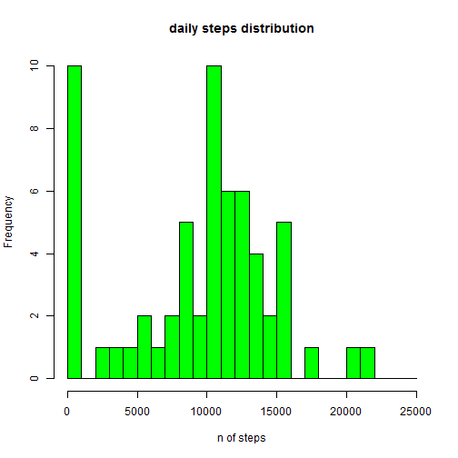
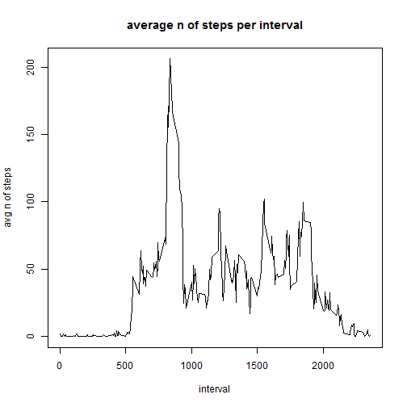
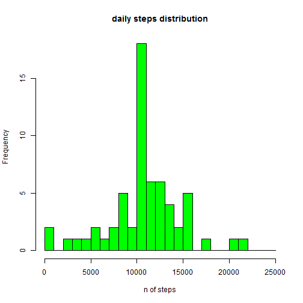
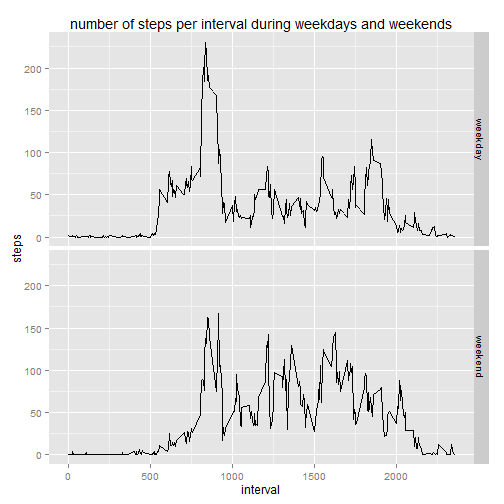

This is an R Markdown document describing an assignment for Reproducible Research Coursera course that makes use of data from a personal activity monitoring device. This device collects data at 5 minute intervals through out the day. The data consists of two months of data from an anonymous individual collected during the months of October and November, 2012 and include the number of steps taken in 5 minute intervals each day.

To performe this analysis it is necessary to load a couple of libraries:


```r
library(dplyr)
library(ggplot2)
```

###Loading and preprocessing the data
The data can be can be downloaded from the course web site and then upladed and preprocessed


```r
x<-read.csv("aCtivity.CSV",na.strings = "NA",header = TRUE, sep = ",")
x$date<-as.Date(x$date)
```

###What is mean total number of steps taken per day?

The total number of steps taken per day is shown in the following histogram


```r
x1<-group_by(x,date)
x2<-summarize(x1, steps = sum(steps, na.rm = TRUE))
hist(x2$steps,main="daily steps distribution",xlab="n of steps",breaks=c(1000*0:25),col="green")
```

 

```r
m1<-median(x2$steps,na.rm = TRUE)
m2<-round(mean(x2$steps,na.rm = TRUE),digits=1)
```

- The average number of steps is 9354.2
- The median number of steps is 10395 

###What is the average daily activity pattern?

This plot shows a time series of the average number of steps taken along the time intervals averaged across all days 


```r
x3<-group_by(x,interval)
x4<-summarize(x3, steps = mean(steps, na.rm = TRUE))
plot(x4$interval,x4$steps,type="l",main="average n of steps per interval",xlab="interval",ylab="avg n of steps")
```

 

```r
x4 <- arrange(x4, steps)
t1<-tail(x4,1)[1]
t2<-round(tail(x4,1)[2],digits=1)
```

The 5-minute interval **835** contains the maximum n of steps ( **206.2**)


###Imputing missing values

There are a number of days/intervals where there are missing values (coded as NA). The presence of missing days may introduce bias into some calculations or summaries of the data.


```r
y<-round(mean(is.na(x$steps))*100,digits=1)
y2<-sum(is.na(x$steps))
```
The total number of missing values in the dataset are **2304** (**13.1**%)

A new dataset is created equal to the original dataset but with the missing data filled in using the the mean for that 5-minute interval.

The total number of steps taken each day is then recalculated.

```r
x5<-merge(x,x4,by.x="interval",by.y="interval")
names(x5)<-c("interval","steps","date","avg_steps")
x5<-mutate(x5,steps2=ifelse(is.na(steps),avg_steps,steps))
x6<-select(x5,c(1,3,5))

x7<-group_by(x6,date)
x8<-summarize(x7, steps2 = sum(steps2, na.rm = TRUE))
hist(x8$steps2,main="daily steps distribution",xlab="n of steps",breaks=c(1000*0:25),col="green")
```

 

```r
m1<-round(median(x8$steps2,na.rm = TRUE),digits=1)
m2<-round(mean(x8$steps2,na.rm = TRUE),digits=1)
```

- The average number of steps is 1.07662 &times; 10<sup>4</sup>
- The median number of steps is 1.07662 &times; 10<sup>4</sup> 

Inputing some missing value (previously excluded from the calculation) brings an increase in the total number of steps

###Are there differences in activity patterns between weekdays and weekends?
A new factor variable in the dataset is created with two levels - "weekday" and "weekend" indicating whether a given date is a weekday or weekend day and a panel plot containing a time series plot of the average number of steps taken in every the 5-minute interval, averaged across all weekday days or weekend days 

```r
x6<-mutate(x6,dayoftheweek=weekdays(date))
x6<-mutate(x6,weekday=factor(ifelse(dayoftheweek=="Sunday"|dayoftheweek=="Saturday","weekend","weekday")))

x9<-group_by(x6,interval,weekday)
x10<-summarize(x9, steps = mean(steps2))
qplot(interval,steps,data=x10,facets=weekday~.,geom="path",main="number of steps per interval during weekdays and weekends")
```

 

